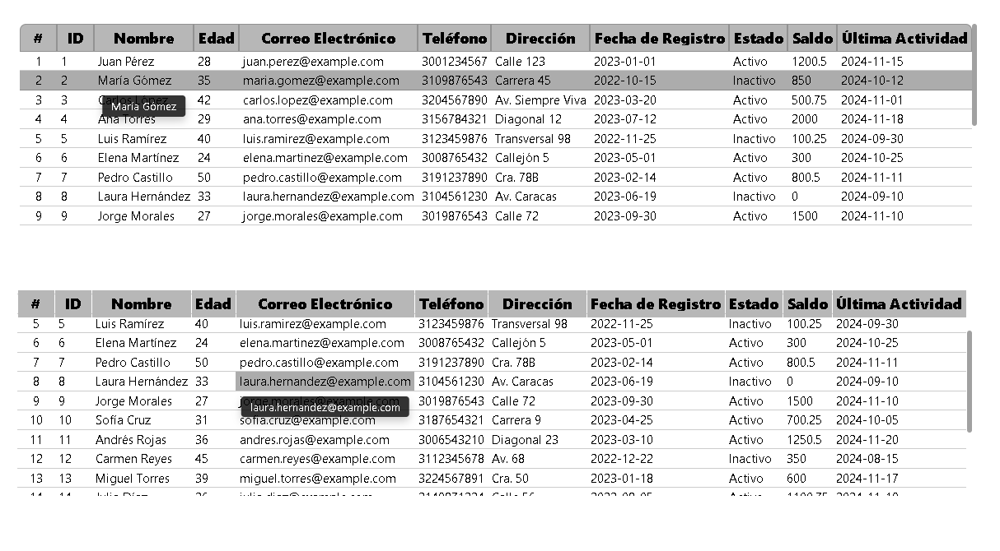

# Perfect Table React

**Perfect Table React** is a highly functional and reusable table component designed to seamlessly integrate into any project. Built with React, it emphasizes simplicity and adaptability, making it easy to customize and understand.

## Features

- **Reusable:** Integrates effortlessly into various projects.
- **No external styling libraries:** Styled with pure CSS and JSX for maximum flexibility and adaptability.
- **React-based:** Created in React for clear component division, ensuring a simple structure that’s easy to follow.
- **Portable:** JSX can easily be adapted to plain HTML, allowing for effortless use across different frameworks or environments.

## Installation

Install the dependencies with:

```bash
pnpm i
```

## Running the App

To start the app, use:

```bash
pnpm dev
```

## Example of Usage

```jsx
const columnas = [
    "ID",
    "Nombre",
    "Edad",
    "Correo Electrónico",
    "Teléfono",
    "Dirección",
    "Fecha de Registro",
    "Estado",
    "Saldo",
    "Última Actividad"
  ];

  const headers: TableHeaderType[] = columnas.map((columna, index) => ({
    content: {
      Label: columna,
    },
    index,
    sortable: true,
    align: "center",
    hoverEffect: true,
    background: "#b7b7b7",
    color: "#000",
    bold: false,
    sortMethod: undefined, //defaultSortMethod
    icon: undefined,
    iconPosition: undefined,
    classname: "",
    tooltip: "dice: "+ columna,
  }))

  const filas = [
    ["1", "Juan Pérez", 28, "juan.perez@example.com", "3001234567", "Calle 123", "2023-01-01", "Activo", 1200.50, "2024-11-15"],
    ["2", "María Gómez", 35, "maria.gomez@example.com", "3109876543", "Carrera 45", "2022-10-15", "Inactivo", 850.00, "2024-10-12"],
    ...
  ];


  const rows: TableRowType[] = filas.map((fila) => ({
    columns: fila.map((columna) => ({
      content: {
        Label: columna.toString(),
        data: {},
      },
      onClick(event) {
        console.log(event);
      },
      background: "#fff",
      color: "#000",
      align: "left",
      tooltip: columna.toString(),
    })),
    hoverEffect: true,
    hoverType: "row",
    actions: [],
    id: fila[0].toString(),
  }))

  return (
    <TableContextProvider>
      <TableContainer
        headers={headers}
        rows={rows}
        isSticky={true}
        maxHeight="200px"
        indexed={true}
        loading={false}
        loader={null} // pass a ReactNode to display a custom loader
        indexColHeaderColor="#000"
        indexColHeaderBackgroundColor="#b7b7b7"
        roundedCorners={true}
      />
    </TableContextProvider>
  );
```

## Default sort method

By default, the table is not sorted, just rendered in the order it was passed. You can order any column by clicking on the header.
the sort method of the column can be provided by setting the `sortMethod` property in the header object.

the default sort method only detect strings, numbers and dates in standar format (detected by Date.parse).

```ts
const defaultSortMethod = (
  a: TableContentIndvidual[],
  b: TableContentIndvidual[]
) => {
  const getColumnValue = (item: TableContentIndvidual[], idx: number) => {
    const value = item[idx]?.content?.Label;
    return value ? value : "";
  };

  // eslint-disable-next-line @typescript-eslint/no-explicit-any
  const detectType = (value: any) => {
    if (!value) return "string";
    if (!isNaN(value)) return "number";
    const date = new Date(value);
    if (!isNaN(date.getTime())) return "date";
    return "string";
  };

  const valueA = getColumnValue(a, index);
  const valueB = getColumnValue(b, index);

  const typeA = detectType(valueA);
  const typeB = detectType(valueB);

  if (typeA === "number" && typeB === "number") {
    return Number(valueA) > Number(valueB)
      ? 1
      : Number(valueA) < Number(valueB)
      ? -1
      : 0;
  }

  if (typeA === "date" && typeB === "date") {
    const dateA = new Date(valueA);
    const dateB = new Date(valueB);
    return dateA > dateB ? 1 : dateA < dateB ? -1 : 0;
  }

  return valueA > valueB ? 1 : valueA < valueB ? -1 : 0;
};
```

## Demo

Here’s a preview of the table in action:



## Notes

I hope you find **Perfect Table React** helpful! Feel free to tweak the styles or extend the functionality to fit your specific requirements. Let me know your thoughts or share how you’ve used it! 🚀
